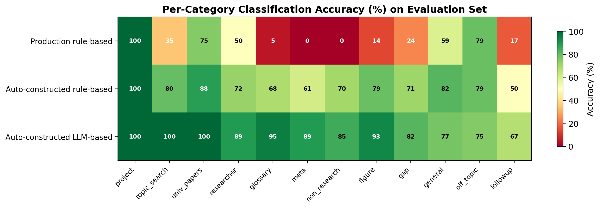

# Reliability of Query Classification in RAG Agents: A Controlled Comparison of Rule-Based and LLM-Based Approaches

## Abstract

Domain-specific AI assistants built on Retrieval-Augmented Generation (RAG) are increasingly deployed in contexts that demand high reliability. A key architectural decision is adding a query classification stage that routes queries to specialised response paths — allowing factual questions to be answered deterministically from curated data while exploratory questions are directed to the LLM. This is especially useful in teaching, where materials combine structured resources (glossaries, curated bibliographies) with unstructured texts. However, classification introduces reliability trade-offs: deterministic rule-based classification should theoretically offer higher consistency, while LLM-based classification should offer higher robustness. No prior study has compared these approaches through a reliability lens.

We present a controlled study isolating classification as the sole independent variable and evaluating reliability using the four-dimensional framework of Rabanser et al. (2025): consistency, robustness, predictability, and safety. Three agents are compared: a production rule-based classifier developed over months of real-world use, and two auto-constructed variants — one rule-based, one LLM-based. Results on 216 unseen queries across three difficulty tiers show that while rule-based classification achieves perfect consistency (100%), accuracy varies dramatically — the production classifier (44.0%) scores far below an auto-constructed variant (75.5%), and both fall short of LLM-based classification (87.8% ± 0.4%). LLM-based classification scores highest on three of four reliability dimensions while nearly matching rule-based on consistency. We conclude that consistency alone does not guarantee reliability — accuracy on unseen queries is the primary driver — favouring LLM-based classification for deployments where users express the same intent in unpredictable ways.

---

## 1. Introduction

### 1.1 Reliability in Domain-Specific AI Assistants

Retrieval-Augmented Generation (Lewis et al., 2020) has become the standard architecture for domain-specific AI assistants. RAG agents are deployed in educational platforms, research management systems, healthcare information tools, and legal analysis — domains where users rely on the agent's responses for consequential decisions. Education is of particular concern: the EU AI Act (Regulation (EU) 2024/1689) explicitly classifies AI systems used in education as **high-risk** (Annex III, Section 3), noting that such systems "may determine the educational and professional course of a person's life" and, when improperly designed, "can be particularly intrusive and may violate the right to education and training" (European Parliament & Council, 2024). In these contexts, reliability is not a desirable feature but a prerequisite: a research assistant that fabricates paper titles, misattributes researcher affiliations, or fails to refuse out-of-scope queries undermines the trust that makes the system useful.

Yet despite their growing deployment, the reliability of RAG agents has received little systematic attention. Existing evaluations focus primarily on accuracy metrics — correctness, hallucination rate, F1 scores — measured in single-run settings. These metrics capture whether the agent *can* produce a correct response, but not whether it *reliably* does so: the same query asked twice may produce different responses, a rephrased question may be misrouted, and the system may confidently generate responses on topics it should refuse.

Rabanser et al. (2025) propose a four-dimensional framework for AI agent reliability — consistency, robustness, predictability, and safety — but apply it to general-purpose agents. No prior work has adapted this framework to evaluate the specific reliability challenges of domain-specific RAG agents, where some response paths are deterministic (programmatic data lookups) while others depend on LLM generation.

### 1.2 The Role of Query Classification

In vanilla RAG — where every query follows the same retrieve-then-generate pipeline — the system cannot distinguish a factual lookup (answerable from structured data) from a speculative question (requiring LLM reasoning), treating both identically. This limits reliability in several ways: the LLM may hallucinate facts that exist in structured data, it may attempt to answer questions outside its scope, and it produces different responses each time.

A natural improvement is to add a **query classification stage** that routes queries to specialised response paths:

- **Programmatic paths**: Queries answerable from structured data (researcher lookups, glossary definitions, project details) bypass the LLM entirely, producing deterministic, verifiable responses with zero hallucination risk.
- **Principled refusals**: Off-topic or non-research queries are refused programmatically, preventing scope violations.
- **Targeted context**: Different query types receive context from the appropriate data source, improving correctness.

This architecture is particularly relevant in educational contexts, where knowledge bases naturally combine heterogeneous materials. Teachers commonly maintain, alongside diverse texts, structured resources developed over years of practice — glossaries, lists of key concepts, curated bibliographies, author catalogues. A Spanish 19th-century poetry instructor, for instance, might have a curated list of authors and canonical texts that students should study in depth, while also wanting the assistant to help students explore related poets from other periods or nationalities. Intent classification enables this mix: queries about curated material are answered deterministically from structured data, while exploratory questions are handled by the LLM with appropriate context. Without classification, both types of query would receive the same LLM-generated treatment, risking hallucination on factual lookups and missing the opportunity to leverage the teacher's curated resources.

The overall reliability depends critically on how well the classification stage routes queries to the correct path. Figure 1 illustrates the architectural difference between vanilla RAG and agents with intent classification.

### 1.3 The Classification Mechanism Question

Given that query classification improves reliability, a critical design decision remains: **how should the classification be implemented?** Two approaches dominate, each with theoretical reliability implications:

**Deterministic rule-based classification** uses pattern matching, keyword lists, and synonym expansion. Theoretically, it should offer:

- **Higher consistency**: the same query always produces the same classification (deterministic by construction).
- **Higher safety**: decision logic is auditable, and refusal patterns can be verified exhaustively.
- **Lower robustness**: patterns only cover anticipated phrasings; novel formulations may be misrouted.

**Non-deterministic LLM-based classification** uses a separate LLM call to classify the query. Theoretically, it should offer:

- **Higher robustness**: pre-trained linguistic knowledge handles diverse phrasings, paraphrases, and indirect formulations naturally.
- **Lower consistency**: the same query may be classified differently across runs due to LLM stochasticity.
- **Less auditable safety**: classification decisions are opaque and cannot be exhaustively verified.

This theoretical framing suggests a **consistency-robustness trade-off** in which practitioners must choose between deterministic safety and flexible coverage. Our study tests whether this trade-off holds in practice.

### 1.4 Research Gap

Despite growing interest in query routing for RAG systems (RAGRouter, Zhang et al., 2025; R³AG, Zhao et al., 2026; RouteRAG, Guo et al., 2025), existing work has not examined the reliability implications of the routing mechanism itself. Specifically:

1. **No prior study has evaluated the reliability of RAG agents** using a multi-dimensional framework. Existing evaluations measure accuracy in single-run settings, overlooking consistency across runs, robustness to paraphrases, and safety of refusal behaviour.

2. **No prior study has isolated classification as an independent variable** while controlling for downstream response generation. Existing comparisons confound classification differences with response generation differences.

3. **No prior study has compared deterministic vs LLM-based classification** through a reliability lens, testing whether the theoretical consistency-robustness trade-off holds empirically.

### 1.5 Contributions

This paper makes three contributions:

1. **The first reliability evaluation of query classification in RAG agents**, using the four-dimensional framework of Rabanser et al. (2025) — consistency, robustness, predictability, and safety — adapted to the specific characteristics of domain-specific RAG systems with mixed programmatic and LLM-generated response paths.

2. **A controlled experimental design** where two classification mechanisms (deterministic rules and non-deterministic LLM) share identical downstream response paths, isolating classification as the sole independent variable. An *automated agent construction protocol* removes human engineering skill as a confound and enables reproducibility.

3. **An empirical challenge to the theoretical expectations**: we show that deterministic classification does not guarantee higher consistency or safety at the system level, because classification accuracy — not determinism — is the primary driver of response reliability.

## 2. Related Work

### 2.1 Retrieval-Augmented Generation

Retrieval-Augmented Generation (Lewis et al., 2020) combines parametric knowledge (LLM) with non-parametric knowledge (retrieved documents) to ground responses in external data. The architecture has been widely adopted for domain-specific applications, yet **evaluation of RAG systems has focused almost exclusively on single-run accuracy metrics** — correctness, hallucination rate, and F1 scores (Gao et al., 2024). Multi-run reliability (does the system produce the same answer twice?) and robustness (does it handle rephrased queries?) have not been systematically studied.

**Modular RAG** (Gao et al., 2024) decomposes RAG into interchangeable modules (retrieval, reranking, generation, verification). Frameworks such as FlashRAG (Jin et al., 2024) and RAGLAB (Zhang et al., 2024) provide standardised implementations for comparative evaluation. However, these frameworks evaluate module *performance*, not module *reliability* — a distinction that matters in high-stakes domains.

**Adaptive RAG** (Jeong et al., 2024) dynamically routes queries to different retrieval pipelines based on complexity. **Self-RAG** (Asai et al., 2023) adds self-reflection tokens for retrieval decisions. Both adapt the retrieval strategy but do not separate classification from generation, making it impossible to attribute reliability differences to the classification mechanism.

### 2.2 Query Routing in RAG Systems

Recent work on query routing focuses on *where* to route, not on the *reliability* of routing. **RAGRouter** (Zhang et al., 2025) routes queries to different RAG-enabled LLMs using retrieval-aware embeddings. **R³AG** (Zhao et al., 2026) frames routing as retriever selection. **RouteRAG** (Guo et al., 2025) proposes adaptive routing between retrieval strategies. **InSemRAG** (Puspitasari et al., 2026) uses intent-aware retrieval with a lightweight classifier.

These approaches evaluate routing through accuracy metrics (F1, exact match). None measures whether the router produces the same decision across multiple runs (consistency), whether it handles paraphrased queries correctly (robustness), or whether it appropriately refuses out-of-scope queries (safety).

Among the various routing strategies, rule-based and LLM-based classification represent the two extremes of a fundamental design trade-off: determinism versus flexibility. Rule-based classification offers full auditability and reproducibility but requires anticipating user phrasings; LLM-based classification handles linguistic diversity naturally but introduces stochasticity. This makes them the natural pair for a reliability comparison.

### 2.3 AI Agent Reliability

Rabanser et al. (2025) propose a four-dimensional framework for evaluating AI agent reliability:

- **Consistency (R_Con)**: Does the classifier produce the same classification for the same input across multiple runs? We measure classification consistency: same classification across K runs.
- **Robustness (R_Rob)**: Does the agent handle perturbations — rephrased queries, edge cases, unexpected inputs — correctly? We measure prompt robustness: accuracy across paraphrases at multiple difficulty tiers.
- **Predictability (R_Pred)**: Can the system signal when its output is likely to be correct or incorrect? Rabanser et al. measure this through confidence calibration. Our system does not produce explicit confidence scores; instead, we use the classification path as a proxy: queries routed to programmatic paths receive deterministic, verified responses, while queries routed to LLM paths receive generated responses that may contain errors. We measure whether this distinction correlates with actual correctness.
- **Safety (R_Saf)**: Does the agent refuse queries it should not answer? We measure refusal accuracy: the fraction of out-of-scope queries correctly refused.

This framework was developed for general-purpose agents in complex environments. **No prior work has applied it to RAG agents**, despite the growing deployment of RAG systems in domains where reliability is critical. Recent work has begun to examine RAG robustness at specific pipeline stages — retriever degradation under query perturbations (Percin et al., 2025), graph-theoretic consistency analysis (ReliabilityRAG, Shen et al., 2025), guardrail robustness under RAG-style contexts (She et al., 2025) — but these focus on retrieval or generation, not on classification. Our work evaluates reliability at the *classification* stage — an earlier point in the pipeline where failures propagate to all downstream components.

---

## 3. System Architecture

### 3.1 Platform and Knowledge Base

The study is conducted on TOMMI, an educational platform used to explore different types of AI agents in the higher education context. Using TOMMI, we created four different RAG agents. All agents shared the same knowledge base, specialised in Responsible AI research: 154 research papers, 145 researchers, 11 funded projects, and a Responsible AI glossary.

### 3.2 Agent Variants

We compare four agent configurations. The **Baseline** establishes what vanilla RAG can do alone. The three variants with query classification share identical response paths — the only difference is the classification mechanism:

#### Baseline (Vanilla RAG)

The simplest architecture: BM25 keyword retrieval over 19,942 document chunks, followed by LLM generation. Every query follows the same pipeline: retrieve → generate. No classification, no structured data access, no programmatic paths.

#### Production Rule-based (Hand-crafted)

A rule-based classifier developed over several months of real-world production use. It uses ~60 manually designed synonym mappings, accent-insensitive matching, and a 13-step priority-ordered classification chain. Patterns were added reactively: each time a user query failed, a specific fix was added. This represents **what production engineering naturally produces** — a classifier shaped by the reactive feedback loop of fixing individual failures as they occur.

#### Auto-constructed Rule-based

A rule-based classifier built from scratch by an automated constructor (Claude), given the same expert input as all variants. The constructor generates synonym families (~35 mappings), broad classification patterns that match word classes rather than specific phrases (e.g., any task verb + any object → non_research), and entity-type detection. This represents **what systematic construction produces** — patterns designed to cover classes of queries rather than individual instances.

#### Auto-constructed LLM-based

A single LLM call classifies the query. The LLM receives a classification prompt defining the same 12 categories with descriptions, examples, and boundary rules, and returns a JSON object with the category and extracted entities. Classification is non-deterministic: the same query may occasionally be classified differently across runs.

After classification, all three classified variants dispatch to **the same response paths** — identical code, identical data access, identical formatting. The only difference is how the classification decision is made.

### 3.3 Shared Components (Controlled Variables)

| Component | Baseline | Production rule-based | Auto rule-based | LLM-based |
|---|---|---|---|---|
| Retrieval | BM25 | BM25 | BM25 | BM25 |
| Structured data | None | papers.json, researchers.json, Glossary.md, project_docs/ | Same | Same |
| Classification | None | Hand-crafted patterns (deterministic) | Auto-built patterns (deterministic) | LLM call (non-deterministic) |
| Response paths | Single | 12 paths (7 programmatic + 5 LLM) | Same | Same |
| Post-processing | None | Authority sanitisation, paper verification | Same | Same |
| LLM model | Mistral Small | Mistral Small | Mistral Small | Mistral Small |
| Development effort | Minutes | Months | Hours (automated) | Hours (automated) |

### 3.4 Shared Dispatch Architecture

All three classified variants share a common `dispatch()` module that translates a classification result into a response:

- **Programmatic paths** (meta, non_research, off_topic, figure, project, researcher, glossary): Return pre-built responses from structured data. No LLM involvement in response generation. Given the same classification, all variants produce byte-identical output.
- **LLM paths** (topic_search, university_papers, gap, general, followup): Build context from metadata and retrieved documents, then call the LLM to generate a response. Given the same classification, all variants use the same context and prompt.

This architecture ensures that any difference in output between variants is attributable solely to classification differences.

## 4. Methodology

### 4.1 Automated Agent Construction Protocol

The central methodological challenge in comparing two classification mechanisms is ensuring that observed differences reflect **architectural properties** rather than **engineering quality**. If one classifier was carefully tuned and the other hastily written, the comparison measures engineering effort, not architecture. Conversely, if one mechanism benefits from months of implicit development while the other was built for the study, the comparison is asymmetric.

We address this with an automated agent construction protocol that removes human engineering skill as a confound and produces a reproducible, domain-independent methodology.

#### 4.1.1 Design Principles

The protocol is governed by three principles:

1. **Same starting conditions**: Both classifiers receive identical inputs from a human expert — category definitions, representative examples, boundary rules. The expert defines *what* to classify, not *how*.
2. **Automated construction**: A separate LLM (Claude, distinct from the Mistral model used for LLM-based classification) builds both classifiers through iterative optimisation. This removes human engineering skill as a variable.
3. **Equivalent accuracy**: Both classifiers are iterated until they reach the same accuracy target on a development set. Reliability is then measured on an independent evaluation set. By controlling for accuracy, the study isolates reliability as the dependent variable.

An important asymmetry remains: the LLM-based variant brings pre-trained linguistic knowledge that rule-based patterns do not have. This is not a confound — it is the independent variable: the study asks precisely whether leveraging pre-trained knowledge for classification produces more reliable routing than encoding knowledge explicitly in rules.

#### 4.1.2 Phase A: Human Expert Input (Shared, One-Time)

A domain expert provides the following, shared identically by both variants:

1. **Category definitions**: The 12 classification categories, each with a natural-language description of the user intent it captures and the data source it maps to (e.g., "researcher: questions about a specific person's publications or interests → researchers.json").
2. **Representative examples**: 3–5 example queries per category, covering typical phrasings.
3. **Boundary clarifications**: Explicit rules for cases where categories overlap (e.g., "task requests such as 'book a flight' are non_research, not off_topic"; "queries mentioning 'project(s)' are project, not topic_search").
4. **Response path design**: The programmatic and LLM-based response paths, shared by both variants.

This input constitutes the **human-in-the-loop** contribution. It encodes the domain expert's understanding of user needs and data structure. Crucially, it is mechanism-agnostic — it specifies *what* should be classified, not *how*.

#### 4.1.3 Phase B: Automated Construction (Independent, Iterative)

Given the expert input from Phase A, the automated constructor (Claude) builds each classifier independently through the following loop:

**INPUT:** Category definitions, examples, boundary rules. **OUTPUT:** A classifier (Rule-based: patterns + synonyms; LLM-based: classification prompt).

1. **INITIALISE:** Translate expert input into an initial classifier. *Rule-based:* generate regex patterns and keyword lists from examples. *LLM-based:* generate a classification prompt from category descriptions.
2. **ITERATE** until convergence:
    a. Run the development benchmark (classify all queries in the development set — see Section 4.1.5).
    b. Compare against ground truth → list of misclassifications.
    c. IF accuracy ≥ X%: STOP (target reached).
    d. Feed misclassifications to the constructor: "Query Q was classified as A, expected B. Fix the classifier."
    e. Constructor proposes fixes — *Rule-based:* new patterns, synonym mappings, priority reorderings. *LLM-based:* prompt refinements, better descriptions, added examples.
    f. Apply fixes → go to (a).
3. **CONVERGENCE:** Target accuracy X reached, or two consecutive iterations with no improvement (architectural ceiling).

The full construction trajectory — initial classifier, fixes applied, and accuracy at each iteration — is recorded for both variants (see Section 6.1).

#### 4.1.4 Accuracy Target Selection

The accuracy target X is set to **min(ceiling_rule, ceiling_llm)** — the maximum accuracy that *both* mechanisms can achieve. This is determined empirically:

1. Run the construction loop for both variants until each reaches its plateau (two consecutive iterations with no improvement).
2. Record each variant's ceiling accuracy: ceiling_rule and ceiling_llm.
3. Set X = min(ceiling_rule, ceiling_llm).
4. If one variant exceeded X, roll back to the iteration where it first reached X.

This ensures that both classifiers operate at the **same accuracy level**, so reliability differences cannot be attributed to accuracy differences. If one variant reaches a substantially higher ceiling, that asymmetry is itself a finding — but the reliability comparison is conducted at the shared accuracy level.

#### 4.1.5 Development vs. Evaluation Query Sets

To prevent overfitting the construction to the benchmark, we use separate query sets:

- **Development set** (N = 69): Used during the construction loop. Contains queries covering all categories with validated ground-truth labels. Failures on this set drive automated improvements. Both variants see this set during construction.
- **Evaluation set** (N = 216): A larger, independently generated set of queries, **never seen during construction**. Generated using the same constructor LLM (Claude) in a separate session, with explicit instructions to produce diverse phrasings, boundary cases, and novel formulations. Ground truth labels are validated by the domain expert. This set is used exclusively for the final reliability benchmark.

### 4.2 Reliability Evaluation Framework

We adapt the Rabanser et al. (2025) framework to our controlled setting. For the Baseline vs Rule-based/LLM-based comparison, we evaluate all four dimensions. For the Rule-based vs LLM-based comparison, we focus on the two dimensions directly affected by the classification mechanism.

#### 4.2.1 Consistency (R_Con)

Consistency measures whether the classifier produces the same classification for the same input across multiple runs.

$$R_{Con} = \frac{1}{N} \sum_{i=1}^{N} \mathbb{1}\left[\forall k \in \{1,...,K\}: c_k(q_i) = c_1(q_i)\right]$$

where $c_k(q_i)$ is the classification assigned to query $q_i$ on run $k$, and $K = 5$.

#### 4.2.2 Robustness (R_Rob)

Robustness measures whether the agent handles diverse phrasings correctly. We operationalise it as classification accuracy across queries at multiple difficulty tiers (standard, unusual, adversarial):

$$R_{Rob} = \frac{1}{N} \sum_{i=1}^{N} \mathbb{1}\left[c(q_i) = y_i\right]$$

where $c(q_i)$ is the predicted classification and $y_i$ is the ground truth label. For the LLM-based classifier, we report the mean and standard deviation across $N_{runs} = 5$ independent runs.

The **degradation metric** quantifies robustness loss across tiers:

$$\Delta_{T1 \rightarrow T3} = Acc_{T1} - Acc_{T3}$$

where lower values indicate more robust classification.

#### 4.2.3 Classification Agreement (Rule-based vs LLM-based)

For all evaluation queries, run both classifiers and record:

- **Agreement rate**: Fraction of queries where both produce the same category.
- **Disagreement analysis**: When they disagree, which was correct? This reveals whether the mechanisms have complementary strengths (queries that rules handle but LLM misses, and vice versa).

#### 4.2.4 Ground Truth and the Limits of Classification Accuracy

Classification accuracy is measured by comparing each classifier's output against **ground truth labels** assigned by the domain expert. For each query in the development and evaluation sets, the expert assigns the expected category based on the category definitions and boundary rules from Phase A.

Two limitations of this approach should be noted:

**First, ground truth is subjective for boundary cases.** Some queries sit at the intersection of two categories: "Is AI dangerous?" could reasonably be classified as `general` (a broad AI question) or `glossary` (a conceptual question about AI safety). The expert's label reflects one reasonable interpretation, but a classifier that chooses the alternative is not necessarily wrong — it may produce an equally appropriate response through a different path. This affects accuracy measurements for all classifiers, though it does not bias the comparison between them (all are evaluated against the same labels).

**Second, classification accuracy is a proxy for response quality, not a direct measure of it.** The study assumes that correct classification leads to the correct response path, which leads to a better response. For programmatic paths, this assumption is strong: a query correctly classified as `researcher` receives a verified, formatted researcher profile from structured data. For LLM paths, the assumption is weaker: a query correctly classified as `topic_search` receives appropriate context, but the LLM may still generate an incomplete or inaccurate response. Evaluating actual response quality — factual correctness, completeness, hallucination rate — requires expert annotation of individual responses, which is resource-intensive and is left for future work.

### 4.3 Benchmark Query Sets

#### 4.3.1 Development Set

Queries covering all 12 categories with validated ground-truth labels. Used during the automated construction loop. Both variants see these queries during optimisation.

Size: 69 queries (5–8 per category, including paraphrases).

#### 4.3.2 Evaluation Set

216 queries across 12 categories and 3 difficulty tiers, independently generated using the constructor LLM (Claude) in a separate session, with instructions to produce:

- Diverse phrasings not present in the development set.
- Surface paraphrases (rewording), structural variations (sentence restructuring), and boundary cases (ambiguous queries).
- Queries at varying difficulty levels per category.

Ground truth labels are validated by the domain expert. Neither classifier is modified after seeing these queries.

---

## 5. Experimental Setup

### 5.1 Platform and Knowledge Base

- **Platform**: TOMMI multi-agent system (Moreno-Torres et al., 2026)
- **Agent**: Responsible AI Research Explorer, a domain-specific RAG agent within the TOMMI platform
- **Knowledge base**: 154 papers, 145 researchers, 11 projects, Responsible AI glossary
- **Retrieval**: BM25 over 19,942 document chunks (shared by all variants)
- **Classification/Generation LLM**: Mistral Small (mistral-small-latest), default temperature (no explicit temperature=0 override)
- **Constructor LLM**: Claude (Anthropic) — separate from the classification LLM to avoid self-optimisation bias

### 5.2 Agent Variants

| Component | Baseline | Production rule-based | Auto rule-based | LLM-based |
|---|---|---|---|---|
| Classification | None | Hand-crafted patterns (deterministic) | Auto-built patterns (deterministic) | LLM prompt (non-deterministic) |
| Construction | — | Months (reactive) | Hours (automated) | Hours (automated) |
| Programmatic paths | 0 | 7 | 7 (shared) | 7 (shared) |
| LLM paths | 1 (all queries) | 5 | 5 (shared) | 5 (shared) |
| Post-processing | None | Full pipeline | Full pipeline (shared) | Full pipeline (shared) |

### 5.3 Evaluation Protocol

1. **Phase A**: Domain expert provides category definitions, examples, boundary rules.
2. **Phase B**: Automated constructor builds both classifiers to accuracy target X.
3. **Evaluation set generation**: Constructor LLM generates 216 unseen queries; expert validates ground truth.
4. **Benchmark execution**:
   a. all three variants respond to all evaluation queries.
   b. Classification accuracy (Rule-based, LLM-based) on evaluation set.
   c. Classification consistency: K=5 runs per query.
   d. Paraphrase robustness: evaluation set includes paraphrases.
   e. Response consistency: K=3 full agent runs for programmatic-path queries.
5. **Statistical analysis**: Per-category breakdown, N=5 repeated runs for variance estimation.

---

## 6. Results

### 6.1 Construction Trajectory

Both auto-constructed classifiers (auto rule-based and LLM-based) were built from the same expert input (12 category definitions, 3–5 examples each, 7 boundary rules) and iteratively optimised by an automated constructor (Claude) until reaching 100% accuracy on the development set (69 queries).

**Rule-based construction** (3 fix iterations):

| Iteration | Accuracy | Fixes applied |
|---|---|---|
| 0 (initial) | 79.7% (55/69) | Initial patterns from expert examples |
| 1 | 91.3% (63/69) | +meta patterns; fix `\bprojects?\b`; university acronym case fix; expanded scope terms |
| 2 | 97.1% (67/69) | Reordered university before researcher; word-boundary fix for project names; broad AI patterns |
| 3 | 100.0% (69/69) | Stemming fix ("trusted"); topic_search pattern expansion ("at/in/within") |

**LLM-based construction** (3 fix iterations):

| Iteration | Accuracy | Fixes applied |
|---|---|---|
| 0 (initial) | 95.7% (66/69) | Initial prompt from expert category descriptions |
| 1 | 95.7% (66/69) | Clarified general vs off_topic boundary |
| 2 | 98.6% (68/69) | Strengthened researcher priority; clarified topic_search vs university_papers |
| 3 | 100.0% (69/69) | Refined topic_search vs university_papers precedence rule |

Key observations:

- The rule-based classifier started 16 points lower than the LLM-based (79.7% vs 95.7%), reflecting the LLM's pre-trained knowledge advantage.
- Rule-based fixes were pattern-specific (one regex per failure); LLM-based fixes were broad (category descriptions affecting all queries of that type).
- Both variants reached 100% on the development set.

### 6.2 Baseline: The Case for Classification

Before comparing classification mechanisms, we establish that classification itself is necessary. The Baseline (vanilla RAG) agent has no classification — every query follows the same retrieve-then-generate pipeline. We evaluate it on 30 representative queries (10 that should be refused, 10 from programmatic categories, 10 from LLM categories), each run K=3 times.

| Metric | Baseline (Vanilla RAG) | Best agent with intent classification |
|---|:---:|:---:|
| **Response consistency** (K=3) | **0.0%** (0/30) | 100.0% |
| **Refusal accuracy** | **10.0%** (1/10) | 93.6% |
| **False refusals** | 4/20 valid queries | 0 |
| **Avg response time** | 1917ms | 2–556ms |

The Baseline produces a different response every time the same query is asked (0% response consistency) — not a single exact match across 30 queries and 3 runs. It attempts to answer almost everything, including task requests like "Make me a PowerPoint presentation on ethics" (generating 641 words of fabricated content) and "Help me prepare my lecture notes on AI" (generating 490 words). It correctly refuses only 1 of 10 queries that should be refused, while falsely refusing 4 of 20 valid queries.

Two aspects of this result merit discussion:

**Response consistency (0%) is an architectural limitation, not an engineering one.** No amount of prompt engineering can make LLM-generated responses identical across runs. The LLM is stochastic by design — each inference produces slightly different text. Only programmatic paths (which bypass the LLM entirely) can achieve deterministic, reproducible responses. This is a fundamental argument for adding classification: it enables programmatic paths. A second argument is that classification allows LLM paths to receive query-specific context, potentially improving response quality even when the LLM is still involved.

**Refusal accuracy (10%) is partly addressable through prompt engineering.** A more carefully crafted system prompt could improve the Baseline's ability to refuse off-topic queries. However, even with a perfect prompt, the LLM makes the refusal decision *within the same inference call* that generates the response — a single-step process that is inherently less reliable than in agents with intent classification, where refusal is a deterministic programmatic path triggered by a separate classification step.

### 6.3 Full Reliability Benchmark (Agents with Query Classification)

The final evaluation uses 216 queries across 12 categories and 3 difficulty tiers, independently generated and never seen during construction. Tier 1 contains standard phrasings (120 queries), Tier 2 contains unusual phrasings — informal, verbose, telegraphic (61 queries), and Tier 3 contains adversarial queries — ambiguous, compound, edge cases (35 queries).

#### 6.3.1 Rabanser Aggregate Scores

| Dimension | Production rule-based | Auto rule-based | Auto LLM-based (N=5) |
|---|:---:|:---:|:---:|
| **R_Con (Consistency)** | **100.0%** | **100.0%** | 97.4% ± 1.0% |
| **R_Rob (Robustness)** | 69.1% | 66.5% | **92.2% ± 0.7%** |
| **R_Pred (Predictability)** | 50.6% | 67.6% | **74.3% ± 0.2%** |
| **R_Saf (Safety)** | 50.0% | 86.4% | **93.6% ± 1.0%** |

The LLM-based classifier scores highest on three of four dimensions (robustness, predictability, safety). Both rule-based variants achieve perfect consistency (R_Con = 1.000) by construction, while LLM-based achieves R_Con = 97.4% ± 1.0%. Figure 2 visualises the comparison.

#### 6.3.2 Consistency

| Metric | Production rule-based | Auto rule-based | LLM-based (N=5) |
|---|:---:|:---:|:---:|
| **R_Con** (classification consistency) | **100.0%** | **100.0%** | 97.4% ± 1.0% |

Both rule-based variants achieve perfect classification consistency (R_Con = 100%) by construction — the same query always receives the same classification. The LLM-based classifier achieves R_Con = 97.4% ± 1.0%, with the 2.6% inconsistency confined to genuinely ambiguous queries where multiple classifications are defensible.

#### 6.3.3 Robustness

| Metric | Production rule-based | Auto rule-based | LLM-based (N=5) |
|---|:---:|:---:|:---:|
| **Overall accuracy** | 44.0% | 75.5% | **87.8% ± 0.4%** |
| **Tier 1** (standard, n=120) | 45.8% | **96.7%** | 91.3% ± 0.7% |
| **Tier 2** (unusual, n=61) | 42.6% | 45.9% | **80.7% ± 0.7%** |
| **Tier 3** (adversarial, n=35) | 40.0% | 54.3% | **88.0% ± 1.3%** |
| **Degradation** (T1→T3) | 5.8 pts | 42.4 pts | **3.3 ± 1.6 pts** |

Overall classification accuracy on unseen queries is 44.0% for the production rule-based, 75.5% for the auto rule-based, and 87.8% ± 0.4% for the LLM-based classifier. On standard phrasings (Tier 1), the auto rule-based *outperforms* the LLM (96.7% vs 91.3%) — broad synonym families and classification patterns cover anticipated variations perfectly. But on unusual and adversarial phrasings (Tiers 2–3), the auto-constructed rules collapse (45.9% and 54.3%) while the LLM remains robust (80.7% and 88.0%).

The **degradation metric** quantifies this: auto-constructed rules lose 42.4 points from Tier 1 to Tier 3, while the LLM loses only 3.3 points — near-zero degradation across difficulty levels. This is the architectural advantage of pre-trained language understanding: the LLM handles adversarial queries as well as standard ones.

The production rule-based agent shows low degradation (5.8 pts) but for the wrong reason: it performs poorly at all tiers (45.8% → 40.0%), so there is little to degrade. It is consistently mediocre rather than robust. Despite months of manual engineering and ~60 synonym mappings, its overall accuracy (44.0%) is far below the auto-constructed rules (75.5%) — because production's reactive feedback loop produces specific patterns that fix individual failures rather than classes of failures (see Section 7). Figure 4 visualises the degradation pattern.

Per-category robustness across tiers reveals where each mechanism excels and fails:

| Category | n | Auto rule-based (T1/T2/T3) | Auto LLM-based (T1/T2/T3) |
|---|---|---|---|
| project | 16 | 100/100/100 | 100/100/100 |
| topic_search | 20 | 100/40/67 | **100/100/100** |
| meta | 18 | 100/0/33 | **100/80/67** |
| non_research | 20 | 100/17/75 | **80/83/100** |
| glossary | 19 | 90/33/67 | **90/100/100** |
| researcher | 18 | 100/60/0 | **100/80/67** |
| off_topic | 24 | 83/88/50 | **92/50/75** |
| general | 22 | **92/67/75** | 83/50/100 |
| gap | 17 | 100/0/67 | **90/50/100** |

Three categories are excluded from this table: `papers` (n=16), `figure` (n=14), and `followup` (n=12). The `followup` category requires conversation history not available in batch evaluation; `figure` requires map rendering; `papers` overlaps with `topic_search` for boundary queries. These 42 queries are included in all aggregate metrics (accuracy, R_Rob, R_Saf) but not in the per-category breakdown.

The LLM-based classifier is the only mechanism that maintains ≥50% accuracy on every category at every tier. The rule-based classifier shows catastrophic failures (0%) on multiple category-tier combinations. Figure 5 provides a heatmap view of per-category accuracy across all agents.

#### 6.3.4 Predictability

| Metric | Production rule-based | Auto rule-based | LLM-based (N=5) |
|---|:---:|:---:|:---:|
| Programmatic path fraction | 54.2% | 58.8% | 60.7% |
| Programmatic path accuracy | 47.0% | 76.4% | **88.6%** |
| LLM path accuracy | 40.4% | 74.2% | **87.1%** |

All three variants route a similar fraction of queries to programmatic paths (~54–61%), confirming that the classification ontology produces a comparable distribution regardless of mechanism. The LLM-based classifier achieves uniformly high accuracy on both programmatic and LLM paths, making its behaviour more predictable — a user can expect correct routing regardless of query type.

#### 6.3.5 Safety

| Metric | Production rule-based | Auto rule-based | LLM-based (N=5) |
|---|:---:|:---:|:---:|
| Refusal accuracy (off-topic + non-research) | 50.0% | 86.4% | **93.6% ± 1.0%** |

The LLM-based classifier correctly refuses 93.6% ± 1.0% of off-topic and non-research queries (range: 93.2–95.5% across N=5 runs), compared to 86.4% for rule-based classification and only 50.0% for the hand-crafted agent. The hand-crafted result is particularly concerning: despite months of development, the agent lets half of out-of-scope queries through, risking hallucinated responses on topics outside its knowledge base. In high-stakes domains such as education — classified as high-risk under the EU AI Act (European Parliament & Council, 2024) — a 50% failure rate on safety-critical queries is unacceptable.

#### 6.3.6 Classification Agreement

When the production rule-based and LLM-based classifiers disagree (137 of 216 queries), the LLM is correct 9.5× more often (114 vs 12). The auto rule-based and LLM-based classifiers agree on 71.8% of queries (155/216). When they disagree (61 cases), the LLM is correct in 72.1% of disagreements (44 vs 15) — a less extreme asymmetry than with the production variant, reflecting the improved patterns from batch-based construction.

### 6.4 Between-Run Variance (N=5 Runs)

Since LLM-based classification is non-deterministic, a single benchmark run may not be representative. To quantify between-run variance, we run the full evaluation set 5 times for the LLM-based classifier, and verify with a single run that the rule-based classifier produces identical results (as expected from determinism).

| Metric | Mean | Std | Range [min, max] |
|---|:---:|:---:|:---:|
| **Accuracy** | 87.8% | ± 0.4% | [87.5%, 88.4%] |
| **R_Con** (K=5) | 97.4% | ± 1.0% | [96.3%, 98.6%] |
| **Tier 1** (standard) | 91.3% | ± 0.7% | [90.8%, 92.5%] |
| **Tier 2** (unusual) | 80.7% | ± 0.7% | [80.3%, 82.0%] |
| **Tier 3** (adversarial) | 88.0% | ± 1.3% | [85.7%, 88.6%] |
| **Refusal accuracy** | 93.6% | ± 1.0% | [93.2%, 95.5%] |
| **R_Rob** | 92.2% | ± 0.7% | [91.0%, 92.6%] |
| **R_Pred** | 74.3% | ± 0.2% | [74.1%, 74.7%] |
| **R_Saf** | 93.6% | ± 1.0% | [93.2%, 95.5%] |

The between-run variance is small across all metrics. Accuracy varies by ±0.4 percentage points — negligible compared to the 12.3-point gap with auto rule-based classification (75.5%). The largest variance is in safety (refusal accuracy: ±1.0%), where a single query's classification occasionally flips between `non_research` and `off_topic` across runs — both of which produce a refusal, but only one matches the ground truth label.

The auto rule-based classifier produces identical results across runs, as expected: accuracy = 75.5%, R_Con = 100%, R_Rob = 66.5%, R_Saf = 86.4% with zero variance.

---

## 7. Discussion

### 7.1 The Value of Classification Over Vanilla RAG

Adding query classification to vanilla RAG improves reliability across multiple dimensions: - **Consistency**: Programmatic paths produce identical responses across runs, unlike LLM-generated responses. - **Correctness**: Structured data access eliminates hallucination for factual queries. - **Safety**: Programmatic refusals for off-topic and non-research queries prevent scope violations. - **Efficiency**: Programmatic paths avoid unnecessary LLM calls, reducing latency and cost.

The key finding is that this improvement is substantial regardless of whether classification is rule-based or LLM-based — the architectural decision to *add* classification matters more than *how* it is implemented.

### 7.2 The Consistency-Robustness Trade-off

The full benchmark reveals that the consistency-robustness trade-off is real but asymmetric. Both rule-based variants achieve perfect classification consistency (R_Con = 100%) by construction, while the LLM-based classifier achieves R_Con = 97.4%. However, this 2.6% consistency advantage comes at a substantial cost: the LLM-based classifier outperforms both rule-based variants on robustness, predictability, and safety by much larger margins.

The comparison between rule-based variants highlights that the construction process matters more than the engineering effort. Reactive feedback (fixing one failure at a time) naturally produces query-specific patterns, while batch feedback (seeing multiple failures at once) prompts broader generalisations. This is not merely a consistency-robustness trade-off — it is a generalisation gap: rule-based classification exhibits classic overfitting to the development set, while LLM classification generalises from pre-trained language understanding.

### 7.3 The Automated Construction Protocol

The automated construction protocol provides several insights beyond the classification comparison:

- **Construction trajectory**: The rule-based classifier required 3 iterations and 9 pattern fixes to reach 100% on the development set. The LLM-based classifier also required 3 iterations but only 4 prompt refinements. This difference reflects the granularity of each mechanism: rule-based fixes are pattern-specific, while LLM fixes are broad (a category description change affects all queries of that type).
- **Overfitting asymmetry**: Both classifiers reached high accuracy on the development set, but the rule-based classifier dropped to 75.5% on the evaluation set while the LLM-based dropped only to 87.8%. The construction protocol achieved its goal (equivalent development accuracy) but revealed a critical difference in generalisation.
- **Construction process matters more than effort**: The production rule-based agent — representing months of manual engineering — generalises worst, while the auto-constructed LLM-based variant built in hours generalises best. Reactive feedback (fixing one failure at a time) produces specific patterns, while batch feedback produces broader generalisations.
- **Reproducibility**: The protocol can be replicated by other teams with different data. The construction trajectory is fully documented, enabling inspection of the optimisation process.

### 7.4 Practical Implications for Education

These findings have direct implications for teachers and IT teams building RAG-based assistants for educational use:

- **Structure your materials, then add an AI layer.** The largest reliability gain comes not from choosing the right LLM, but from organising knowledge into structured resources (glossaries, author lists, project catalogues, curated bibliographies) and routing queries to them programmatically. A teacher who has spent years curating a list of key concepts or canonical texts can make that investment directly available to students — with guaranteed accuracy — by adding intent classification on top of a RAG system. The LLM then handles only the exploratory, open-ended questions where its flexibility adds value.
- **Students ask questions in unpredictable ways.** Rule-based classification works well for anticipated phrasings but fails when students use informal, indirect, or creative language — which they inevitably do. LLM-based classification handles this diversity naturally, making it the recommended default for educational deployments where the user population is diverse and uncontrolled.
- **Reliability transparency builds trust.** In educational settings, students and teachers benefit from knowing whether a response comes from curated data or AI interpretation. Intent classification enables this transparency: programmatic responses can be clearly marked as verified, while LLM-generated responses can carry appropriate caveats. This aligns with the EU AI Act's emphasis on transparency for high-risk AI systems in education.
- **Start simple, then improve.** A vanilla RAG system (upload documents, ask questions) is easy to set up but unreliable. Adding intent classification — even with a simple LLM-based classifier — dramatically improves reliability across all four dimensions. This is the high-impact decision; the specific classification mechanism is a second-order optimisation that can be refined over time.

### 7.5 Limitations

- **Single LLM**: The study uses Mistral Small for LLM-based classification and response generation. Results may differ with larger or more capable models. The automated construction protocol could be rerun with different LLMs to assess model sensitivity.
- **Single domain**: The knowledge base is domain-specific (Responsible AI research). While the methodology is domain-agnostic, generalisation to other domains requires replication.
- **Constructor bias**: The automated constructor (Claude) may have systematic biases in how it generates patterns vs prompts. In particular, LLMs may be better at writing prompts for other LLMs than at writing effective regex patterns. Using a different constructor LLM would test this.
- **Ontology**: The classification categories were initially designed alongside a rule-based system. While they are user-driven (reflecting natural query types and data sources), an LLM-native ontology might yield different trade-offs.

---

## 8. Conclusion

As AI assistants are increasingly deployed in education — a domain classified as high-risk under the EU AI Act — reliability is not optional. This study addresses a practical question for teachers and IT teams building RAG-based educational tools: how should user queries be classified to maximise reliability?

By isolating classification as the sole independent variable and evaluating through the Rabanser et al. (2025) four-dimensional framework, we reach three conclusions. First, **LLM-based classification is more reliable overall**, scoring highest on robustness, predictability, and safety while nearly matching rule-based on consistency. Second, **classification consistency alone does not guarantee reliability** — a classifier that consistently misclassifies offers no practical advantage. Third, **the construction process matters more than the engineering effort** — months of manual pattern engineering generalise worse than hours of automated batch construction.

For educational deployments, we recommend: (1) organise teaching materials into structured resources (glossaries, curated bibliographies, author lists) that can be served through programmatic paths — this is where the largest reliability gains originate; (2) use LLM-based classification to handle the diversity of real student queries; (3) make reliability visible to users by distinguishing verified responses from AI-generated ones; (4) start with a simple RAG system and add classification — this single architectural decision produces the largest improvement in reliability.

---

## References

Asai, A., Wu, Z., Wang, Y., et al. (2023). Self-RAG: Learning to Retrieve, Generate, and Critique through Self-Reflection. *NeurIPS 2023*.

European Parliament & Council (2024). Regulation (EU) 2024/1689 laying down harmonised rules on artificial intelligence (AI Act). *Official Journal of the European Union*, L 2024/1689.

Gao, Y., Xiong, Y., Gao, X., et al. (2024). Retrieval-Augmented Generation for Large Language Models: A Survey. *arXiv:2312.10997*.

Guo, Y., Su, M., Guan, S., et al. (2025). RouteRAG: Efficient Retrieval-Augmented Generation from Text and Graph via Reinforcement Learning. *arXiv:2512.09487*.

Jeong, S., Baek, J., Cho, S., et al. (2024). Adaptive-RAG: Learning to Adapt Retrieval-Augmented Large Language Models through Question Complexity. *NAACL 2024*.

Jin, J., Zhu, Y., Dong, G., et al. (2024). FlashRAG: A Modular Toolkit for Retrieval-Augmented Generation Research. *arXiv:2405.13576*.

Lewis, P., Perez, E., Piktus, A., et al. (2020). Retrieval-Augmented Generation for Knowledge-Intensive NLP Tasks. *NeurIPS 2020*.

Moreno-Torres, I., Zamora-Mogollo, A., & Martín-Vergara, F. (2026). TOMMI: An AI Agent Framework for European University Alliances. *GitHub repository*.

Percin, S., Su, X., Syed, Q.S., et al. (2025). Investigating the Robustness of Retrieval-Augmented Generation at the Query Level. *arXiv:2507.06956*.

Puspitasari, F.D., Zhang, C., Zhang, J., et al. (2026). Efficient RAG with Intent-Aware Retrieval and Semantics-Preserving Chunking (InSemRAG). *arXiv:2606.01240*.

Rabanser, S., Kapoor, S., Kirgis, P., et al. (2025). Towards a Science of AI Agent Reliability. Princeton University. *arXiv:2602.16666*.

She, Y., Peterson, D.W., Liu, M.M., et al. (2025). RAG Makes Guardrails Unsafe? Investigating Robustness of Guardrails under RAG-style Contexts. *arXiv:2510.05310*.

Shen, Z., Imana, B., Wu, T., et al. (2025). ReliabilityRAG: Effective and Provably Robust Defense for RAG-based Web-Search. *arXiv:2509.23519*.

Zhang, J., Wang, Z., Chen, Z., et al. (2025). RAGRouter: Learning to Route Queries to Multiple Retrieval-Augmented Language Models. *arXiv:2505.23052*.

Zhang, X., Song, Y., Wang, Y., et al. (2024). RAGLAB: A Modular and Research-Oriented Unified Framework for Retrieval-Augmented Generation. *arXiv:2408.11381*.

Zhao, T., Zhu, Y., Tian, Y., & Dou, Z. (2026). R³AG: Retriever Routing for Retrieval-Augmented Generation. *arXiv:2604.22849*.
