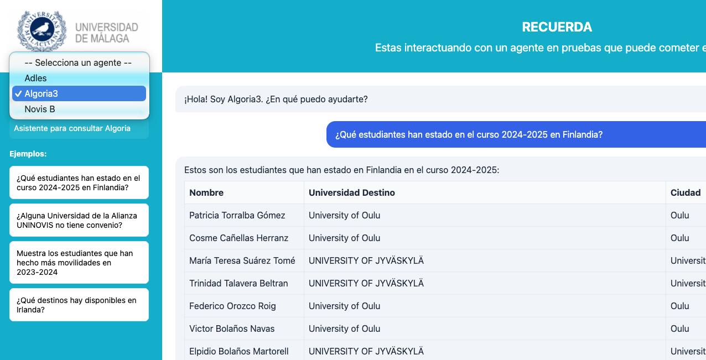

# A practical guide to TOMMI:<br>building and deploying AI agents

**By: UNINOVIS-UMA IT TEAM**

::: {.preface}
TOMMI is an easy to use educational tool that serves to create and test AI agents. With TOMMI:

- IT staff will have rapid hands-on experience with different types of agents;
- academic and admin staff, ideally supported by IT experts, will be able to create agents for their professional context;
- end-users (students, researchers, admin staff) will be able to experience with this technology and explore its potential benefits, thus fostering digital literacy.

TOMMI is built entirely on **open source** tools—Python, FastAPI, ChromaDB, and more—ensuring transparency and flexibility.
:::

::: {.caution}
**Caution:** The use of TOMMI agents for other goals apart from training requires close supervision. IT experts should pay special attention to two main risks. First, no sensitive data should be added unless an IT expert confirms that the agent deployment is safe (e.g., only specific persons have access to the server). Second, adding new tools to TOMMI is feasible, but it may result in dangerous situations (e.g., a tool deleting your hard disk); modifications made on the agents' templates are made at your own risk.
:::

---

## Index

1. [Introduction to Agents](#introduction-to-agents)
   - [1.1 Oneshot Agents](#oneshot-agents)
   - [1.2 RAG Agents](#rag-agents-retrieval-augmented-generation)
   - [1.3 ConsultaBD_SQL Agents](#consultabd_sql-agents)
   - [1.4 Agent Types Comparison](#agent-types-comparison)
2. [Setting Up the TOMMI Agents Service](#setting-up-the-tommi-agents-service)
   - [2.1 Prerequisites](#prerequisites)
   - [2.2 Installation](#installation)
   - [2.3 Project Structure](#project-structure)
   - [2.4 Configuring LLMs](#configuring-llms)
3. [Creating Agents](#creating-agents)
   - [3.1 Using the Interactive Creator](#using-the-interactive-creator)
   - [3.2 Prompt Templates](#prompt-templates)
   - [3.3 Generated Files](#generated-files)
   - [3.4 Agent Configuration](#agent-configuration)
   - [3.5 Adding Data to Your Agent](#adding-data-to-your-agent)
     - [3.5.1 Oneshot Agents: Single Data File](#oneshot-agents-single-data-file)
     - [3.5.2 RAG Agents: Document Collection](#rag-agents-document-collection)
     - [3.5.3 ConsultaBD_SQL Agents: Database Only](#consultabd_sql-agents-database-only)
   - [3.6 Grounding Verification (Anti-hallucination)](#grounding-verification-anti-hallucination)
4. [Interacting with Agents](#interacting-with-agents)
   - [4.1 Web Interface](#web-interface)
     - [4.1.1 Starting the Web Hub](#starting-the-web-hub)
     - [4.1.2 Using the Interface](#using-the-interface)
     - [4.1.3 Interactive Commands for Text-to-SQL Agents](#interactive-commands-for-text-to-sql-agents)
   - [4.2 Terminal](#terminal)
5. [Developer Functionalities](#developer-functionalities)
   - [5.1 Testing Your Agent](#testing-your-agent)
   - [5.2 Using local LLMs](#using-local-llms)
   - [5.3 Local vs Cloud: quality differences](#local-vs-cloud-quality-differences)
   - [5.4 Conversation Logging](#conversation-logging)
6. [Quick Reference](#quick-reference)
   - [6.1 End-User Commands](#end-user-commands)
   - [6.2 Developer API](#developer-api)
   - [6.3 Setup Commands](#setup-commands)
7. [Troubleshooting: Error Codes Reference](#troubleshooting-error-codes-reference)
   - [7.1 LLM Connection Errors (1xx)](#llm-connection-errors-1xx)
   - [7.2 Agent Errors (2xx)](#agent-errors-2xx)
   - [7.3 Data Errors (3xx)](#data-errors-3xx)
   - [7.4 Server Errors (5xx)](#server-errors-5xx)
8. [Annex A: Terminal Command Reference](#annex-a-terminal-command-reference)
   - [A.1 Environment Setup](#a1-environment-setup)
   - [A.2 Agent Management](#a2-agent-management)
   - [A.3 Web Server](#a3-web-server)
   - [A.4 RAG Agent Operations](#a4-rag-agent-operations)
   - [A.5 ConsultaBD_SQL Agent Operations](#a5-consultabd_sql-agent-operations)
   - [A.6 Ollama Commands (Local LLM)](#a6-ollama-commands-local-llm)
   - [A.7 API Testing with curl](#a7-api-testing-with-curl)
   - [A.8 Logs and Debugging](#a8-logs-and-debugging)
   - [A.9 Distribution](#a9-distribution)
   - [A.10 Useful Environment Variables](#a10-useful-environment-variables)

---

## 1. Introduction to Agents

An **agent** is an AI-powered system that can understand natural language queries and respond intelligently. AI agents should not be confused with traditional AI assistants such as ChatGPT or Claude. The latter are powerful but generic: they rely solely on their training data, have no access to your private information, and cannot perform actions beyond generating text. An agent, by contrast, is **specialized** and **connected**. It can access specific knowledge bases (your documents, your database), retrieve relevant information on demand, and even execute actions through tools (run calculations, query APIs, send emails). While a traditional AI might say "I don't have access to that information," an agent built with TOMMI can actually look it up and give you a precise answer.

In educational and institutional settings, agents offer significant advantages. They can provide **24/7 availability** to answer frequently asked questions about admissions, course schedules, or administrative procedures—reducing the workload on staff while improving response times for students. Agents can also serve as **personalized learning assistants**, helping students navigate complex documentation, summarize research papers, or explain institutional policies in plain language. For administrative staff, agents can automate repetitive inquiries and provide consistent, accurate information across departments. At the same time, improper use of agents may have severe consequences for educational institutions (e.g. sensitive data breach, open access to hackers, or even economic costs due to excess of use).

In order for educational institutions to benefit from this novel technology while at the same time minimizing risks, it is crucial that several actions are adopted. These include:

- A clear regulation on the use of agents
- A safe agentic infrastructure
- Training IT and other staff in creating agents
- Training end users on how to interact with AI Agents.

With TOMMI we bring a tool that may help universities to address the last two aspects. Regarding staff, TOMMI allows rapidly hands-on experience with AI Agents, which may accelerate the training process. Regarding end-users, its friendly but transparent interface may encourage use of AI Agents, thus fostering **digital literacy** and critical thinking about how these technologies work.

TOMMI supports three agent types, each suited for different use cases:

### 1.1 Oneshot Agents

The simplest type. Loads all data into memory and includes it directly in the LLM context.

**How it works:**
1. Loads data from `data/data.md` at startup
2. Includes the full data in every system prompt
3. LLM generates response using the embedded context

**Architecture:**
```
┌──────────────┐
│   Question   │────┐
└──────────────┘    │
                    ▼
              ┌──────────┐    ┌──────────────┐
              │    LLM   │───▶│   Response   │
              └──────────┘    └──────────────┘
                    ▲
┌──────────────┐    │
│   data.md    │────┘
│   (static)   │
└──────────────┘
```

**Best for:**
- Small to moderate knowledge bases (< 100KB)
- FAQ systems
- Static information assistants

**Optional feature:** [Grounding verification](#grounding-verification-anti-hallucination) can be enabled to prevent hallucinations by verifying responses against the source data.

**Example:** Conference information assistant that answers questions about schedules, speakers, and venues.

### 1.2 RAG Agents (Retrieval-Augmented Generation)

Uses semantic search to find relevant information before generating responses.

**How it works:**
1. Indexes documents from `data/docs/` into ChromaDB vector database
2. When a query arrives, searches for the most relevant chunks
3. Includes only relevant context in the LLM prompt
4. Generates response based on retrieved information

**Architecture:**
```
┌──────────────┐
│   Question   │──────────────────────┐
└──────┬───────┘                      │
       │                              ▼
       │                        ┌──────────┐    ┌──────────────┐
       │                        │   LLM    │───▶│   Response   │
       │                        └──────────┘    └──────────────┘
       │                              ▲
       │    ┌──────────────┐          │
       └───▶│    Search    │──────────┘
            └──────┬───────┘    (relevant chunks)
                   │
            ┌──────▼───────┐
            │   ChromaDB   │◀── docs/ (PDF, TXT)
            │   (vectors)  │
            └──────────────┘
```

**Best for:**
- Large document collections
- Academic papers or manuals
- Frequently updated content (supports re-indexing)

**Optional feature:** [Grounding verification](#grounding-verification-anti-hallucination) can be enabled to ensure responses are based only on retrieved documents.

**Example:** Academic proceedings Q&A system that searches through hundreds of papers.

### 1.3 ConsultaBD_SQL Agents

Converts natural language questions directly to SQL queries against a database.

**How it works:**
1. User asks a question in natural language
2. Agent uses the configured LLM (Mistral or Ollama) to convert the question to SQL
3. Executes the SQL query against a SQLite database (only SELECT queries allowed)
4. Formats results using Python (fast, no additional LLM call)
5. Displays results in an interactive HTML table

**Architecture:**
```
┌──────────────┐
│   Question   │──────────────────────┐
└──────────────┘                      │
                                      ▼
┌──────────────┐                ┌──────────┐    ┌──────────────┐
│    Schema    │───────────────▶│   LLM    │───▶│ Execute SQL  │
│   (tables)   │                │(text2sql)│    │   (SQLite)   │
└──────────────┘                └──────────┘    └──────┬───────┘
                                                       │
                                                       ▼
                                                ┌──────────────┐
                                                │    Python    │
                                                │  (format)    │
                                                └──────┬───────┘
                                                       │
                                                       ▼
                                                ┌──────────────┐
                                                │   Response   │
                                                │ + HTML table │
                                                └──────────────┘
```

**Best for:**
- Database exploration without SQL knowledge
- Data analysis and reporting
- Quick data lookups
- Educational environments where users need to query data

**Key features:**
- **Single LLM call:** Uses one LLM for SQL generation; formatting is done with Python for speed
- **Security:** Only SELECT queries are allowed; INSERT, UPDATE, DELETE, and other modifying operations are blocked
- **Schema awareness:** Automatically reads and understands the database structure
- **Interactive results:** Displays query results in formatted HTML tables

**Example:** A university department needs to query a database of courses and professors. Users can ask "How many courses are in the Law department?" and get instant results without knowing SQL.

### 1.4 Agent Types Comparison

#### Feature Comparison Table

| Feature | Oneshot | RAG | ConsultaBD_SQL |
|---------|:-------:|:---:|:--------------:|
| **Complexity** | Low | Medium | Medium |
| **LLM Calls per Query** | 1 (or 2)* | 1 (or 2)* | 1 |
| **Vector Database** | - | ✓ | - |
| **SQL Database** | - | - | ✓ |
| **Document Search** | - | ✓ | - |
| **Dynamic Knowledge** | - | ✓ | ✓ |
| **Grounding Verification** | ✓ | ✓ | - |
| **Python Version** | Any | 3.11-3.13 | Any |

\* With grounding verification enabled, requires 2 LLM calls per query.

#### Use Case Recommendations

| Scenario | Recommended Type | Why |
|----------|------------------|-----|
| Simple FAQ with static information | **Oneshot** | Minimal complexity, fastest response |
| Q&A over many documents/PDFs | **RAG** | Semantic search scales to thousands of documents |
| Database queries by non-technical users | **ConsultaBD_SQL** | Natural language to SQL conversion |
| Need lowest latency | **Oneshot** | Single LLM call, no external lookups |
| Need to scale to thousands of documents | **RAG** | Vector database handles large collections |
| Privacy-sensitive data queries | **ConsultaBD_SQL** | Data stays local, only questions sent to LLM |

#### Cost Comparison

| Type | LLM Calls | Total Cost Profile |
|------|-----------|-------------------|
| **Oneshot** | 1 (2 with verification) | Low (Medium with verification) |
| **RAG** | 1 (2 with verification) | Low (Medium with verification) |
| **ConsultaBD_SQL** | 1 | Low |

#### Architecture Summary

```
┌────────────────────────────────────────────────┐
│                  AGENT TYPES                   │
├────────────────────────────────────────────────┤
│                                                │
│  ONESHOT         RAG         CONSULTABD_SQL   │
│  ───────         ───         ──────────────   │
│                                                │
│  Question      Question        Question        │
│     +             +               +            │
│   Data         Search          Schema          │
│     │          Results           │             │
│     │             │              │             │
│     ▼             ▼              ▼             │
│   [LLM]        [LLM]          [LLM]            │
│     │             │              │             │
│     │             │              ▼             │
│     │             │         [SQL DB]           │
│     │             │              │             │
│     │             │              ▼             │
│     │             │          [Python]          │
│     │             │          (format)          │
│     │             │              │             │
│     ▼             ▼              ▼             │
│  Response     Response       Response          │
│                              + HTML table      │
└────────────────────────────────────────────────┘
```

#### Quick Selection Guide

**Choose based on your primary need:**

1. **"I have a small knowledge base (<100KB)"** → **Oneshot**
2. **"I have many documents to search"** → **RAG**
3. **"I want users to query a database naturally"** → **ConsultaBD_SQL**

[↑ Back to index](#index){.back-to-top}

---

## 2. Setting Up the TOMMI Agents Service

### 2.1 Prerequisites

- Python 3.10+ (for Oneshot and ConsultaBD_SQL agents)
- Python 3.11-3.13 (for RAG agents - ChromaDB is **not compatible** with Python 3.14+)
- Mistral API key

> **Note:** If you plan to use RAG agents and have Python 3.14+, install Python 3.12:
> ```bash
> brew install python@3.12  # macOS
> ```

### 2.2 Installation

Run the setup script to configure the environment:

- **Windows:** `apps\setup.bat`
- **Linux/macOS:** `./apps/setup.sh`

The script will automatically create a virtual environment, install dependencies, and configure your API key.

### 2.3 Project Structure

```
tommi/
├── apps/                    # Scripts and utilities
│   ├── setup.sh             # Setup script (Linux/macOS)
│   ├── setup.bat            # Setup script (Windows)
│   ├── crear_agente.py      # Agent creator with built-in templates
│   ├── crear_dist.sh        # Distribution script (Linux/macOS)
│   └── crear_dist.bat       # Distribution script (Windows)
├── web/                     # Central web service hub
│   ├── app.py               # FastAPI server
│   ├── agent_runner.py      # Agent discovery engine
│   └── static/              # Frontend files
└── agents/                  # All agents are stored here
    ├── your_agent/          # Your custom agents
    ├── conf26_cloud/        # Example: conference assistant (cloud)
    ├── conf26_local/        # Example: conference assistant (local)
    └── ...
```

### 2.4 Configuring LLMs

TOMMI supports two LLM providers:
- **Mistral Cloud** (default) - LLMs on the cloud, requires API key
- **Ollama** (optional) - Local LLMs, easy setup, good for development and privacy

For starters, Mistral Cloud is recommended as it requires no local setup.

#### Available Mistral Models

| Model | Use Case |
|-------|----------|
| `mistral-large-latest` | Best quality, complex reasoning (default) |
| `mistral-medium-latest` | Balanced performance |
| `mistral-small-latest` | Fast responses, simple tasks |

#### Default configuration (web/.env)

The file `web/.env` sets the **default configuration for ALL agents**:

```bash
# ============================================
# DEFAULT LLM Provider Configuration
# ============================================
# This is the DEFAULT configuration for all agents.
# Individual agents can override by adding LLM_PROVIDER to their own .env

# --- Cloud LLM (Mistral) - DEFAULT ---
LLM_PROVIDER=mistral
MISTRAL_API_KEY=your_api_key_here
MISTRAL_MODEL=mistral-large-latest

# --- To use Local LLM (Ollama) as default, comment above and uncomment below ---
# LLM_PROVIDER=ollama
# OLLAMA_BASE_URL=http://localhost:11434
# OLLAMA_MODEL=mistral
```

> **Note:** Replace `your_api_key_here` with an API key that you should obtain from Mistral at [https://mistral.ai/](https://mistral.ai/).

[↑ Back to index](#index){.back-to-top}

---

## 3. Creating Agents

### 3.1 Using the Interactive Creator

The easiest way to create a new agent:

```bash
python apps/crear_agente.py
```

The script will prompt you for:

1. **Agent type** (1=oneshot, 2=rag, 3=consultabd_sql)
2. **Agent ID** - Unique identifier (lowercase, alphanumeric)
3. **Output directory** - Where to create the agent
4. **Display name** - Human-readable name
5. **Description** - What the agent does
6. **Welcome message** - Greeting shown to users
7. **Example queries** - Sample questions users can ask
8. **System prompt** - Instructions for the LLM behavior
9. **Grounding verification** - (oneshot/RAG only) Enable anti-hallucination verification
10. **LLM Provider** - Mistral Cloud or Ollama
11. **Model** - Which model to use

### 3.2 Prompt Templates

When creating a new agent, you can choose from pre-defined prompt templates instead of writing a system prompt from scratch. Templates are built into the `crear_agente.py` script and provide a solid starting point for each agent type.

**Available templates:**

| Template | Description |
|----------|-------------|
| Oneshot | Instructions for data-based assistants |
| RAG | Instructions for document retrieval assistants |
| Text2SQL | Instructions for database query assistants |

**How it works:**

During agent creation (`python apps/crear_agente.py`), the script will prompt you to enter a system prompt or use a default template based on the agent type you selected.

**Template variables:**

Templates support the `{agent_name}` variable, which is automatically replaced with your agent's name.

**Customizing after creation:**

Once an agent is created, its prompt is stored in `agent.py` and can be edited independently.

### 3.3 Generated Files

The creator generates a complete agent structure:

```
your_agent/
├── agent.py           # Core agent logic
├── app.py             # FastAPI wrapper with AGENT_CONFIG
├── requirements.txt   # Python dependencies
├── .env               # API credentials
├── .gitignore         # Security (ignores .env)
├── run.sh             # Startup script
├── README.md          # Documentation
└── data/
    ├── data.md        # (oneshot) Knowledge base (to be replaced by your own data)
    ├── docs/          # (rag) Document folder for indexing
    └── database.db    # (text2sql) SQLite database (to be replaced by your own database)
```

### 3.4 Agent Configuration

Each agent defines its metadata in `app.py`:

```python
AGENT_CONFIG = {
    "id": "my_agent",
    "name": "My Agent",
    "type": "oneshot",  # or "rag" or "text2sql"
    "description": "Helps with specific tasks",
    "welcome_message": "Hello! How can I help you?",
    "example_queries": [
        "What can you do?",
        "Tell me about X"
    ]
}
```

You can edit `app.py` at any time to add or remove example queries, change the welcome message, update the description, or modify any other metadata field.

### 3.5 Adding Data to Your Agent

**Why data matters:** LLMs have a knowledge cutoff date and no access to your private information. Without data, an agent is just a generic chatbot. With your data, it becomes a specialized assistant that can answer questions about your specific domain.


#### 3.5.1 Oneshot Agents: Single Data File

Oneshot agents load all their knowledge from a single Markdown file.

**Data location:** `data/data.md`

**How to add data:**
1. Edit `data/data.md` with all the information your agent needs
2. Use Markdown formatting for structure (headers, lists, tables)
3. Keep the file under ~100KB for optimal performance

**Example `data/data.md`:**
```markdown
# Conference information

## Sessions
- **Session A**: Description of session A, time, room
- **Session B**: Description of session B, time, room


## FAQ
### Where is the conference?
...
```

**Note:** The entire file is included in every LLM prompt, so keep it concise and well-organized.

---

#### 3.5.2 RAG Agents: Document Collection

RAG agents index multiple documents and retrieve relevant chunks at query time.

> **Important:** RAG agents require **Python 3.11-3.13**. ChromaDB is not compatible with Python 3.14+. If you see Error 307, install Python 3.12 and recreate the virtual environment.

**Data location:** `data/docs/`

**Supported formats:** `.txt`, `.md`, `.pdf`

**How to add data:**
1. Place your documents in `data/docs/`
2. Use descriptive filenames (e.g., `user-manual.md`, `api-reference.txt`)
3. Documents are automatically chunked and indexed at startup
4. After adding new documents, call the `/reindex` endpoint

**Example structure:**
```
data/
└── docs/
    ├── chapter1-introduction.md
    ├── chapter2-installation.md
    ├── chapter3-configuration.md
    ├── faq.md
    ├── user-manual.pdf
    └── troubleshooting.txt
```

**Re-indexing after changes:**
```bash
curl -X POST http://localhost:8000/reindex
```

**How it works internally:**
- PDF text is extracted using `pypdf`
- Documents are split into chunks (~500 tokens each)
- Each chunk is embedded using `sentence-transformers` (all-MiniLM-L6-v2)
- Embeddings are stored in ChromaDB at `data/chroma_db/`
- On query, the 3 most relevant chunks are retrieved and included in the prompt

**Tip:** Structure your documents with clear headers and sections for better retrieval accuracy.

---

#### 3.5.3 ConsultaBD_SQL Agents: Database Only

ConsultaBD_SQL agents convert natural language questions to SQL queries, executing them against a SQLite database.

**Data location:** `data/database.db`

**How to add data:**

1. Create a SQLite database file at `data/database.db`
2. You can create it using SQL scripts or by importing existing data

**Example using SQL script:**
```bash
cd your_agent/data
sqlite3 database.db < schema.sql
```

**Example `schema.sql`:**
```sql
CREATE TABLE courses (
    id INTEGER PRIMARY KEY,
    name TEXT NOT NULL,
    department TEXT,
    year INTEGER,
    credits INTEGER
);

CREATE TABLE professors (
    id INTEGER PRIMARY KEY,
    name TEXT NOT NULL,
    department TEXT,
    email TEXT
);

INSERT INTO courses VALUES (1, 'Introduction to Law', 'Law', 1, 6);
INSERT INTO courses VALUES (2, 'Constitutional Law', 'Law', 2, 6);
INSERT INTO courses VALUES (3, 'Programming I', 'Computer Science', 1, 6);
```

**How it works:**

ConsultaBD_SQL agents use a single LLM call for SQL generation, and Python for fast result formatting:

1. The LLM converts the natural language question to SQL
2. The SQL is executed against the SQLite database
3. Results are formatted as an HTML table using Python (no additional LLM call)

**Configuration in `.env`:**
```bash
# Using Mistral Cloud
LLM_PROVIDER=mistral
MISTRAL_API_KEY=your_key_here
MISTRAL_MODEL=mistral-large-latest

# Or using Ollama (local)
# LLM_PROVIDER=ollama
# OLLAMA_BASE_URL=http://localhost:11434
# OLLAMA_MODEL=mistral
```

**Security features:**

- Only SELECT queries are allowed
- INSERT, UPDATE, DELETE, DROP, and other modifying operations are blocked
- SQL injection attempts are rejected

**API endpoints:**

| Endpoint | Description |
|----------|-------------|
| `GET /schema` | Returns the database schema |
| `POST /chat` | Process a natural language question |

**Tip:** The agent automatically reads the database schema at startup. Well-designed table and column names (e.g., `student_name` instead of `sn`) help the LLM generate more accurate SQL queries.

### 3.6 Grounding Verification (Anti-hallucination)

Oneshot and RAG agents can optionally verify that their responses are **grounded** in the provided data, preventing the LLM from hallucinating or inventing information not present in the knowledge base.

**How it works:**

1. The agent generates a response based on the data (data.md for oneshot, retrieved chunks for RAG)
2. A second LLM call verifies that ALL factual claims in the response are explicitly stated in the source data
3. If verification fails, a fallback response is returned instead

**Architecture with verification:**
```
┌──────────────┐
│   Question   │──────────────────────┐
└──────────────┘                      │
                                      ▼
┌──────────────┐                ┌──────────┐    ┌──────────────┐
│    Data      │───────────────▶│   LLM    │───▶│   Response   │
│  (context)   │                │(generate)│    └──────┬───────┘
└──────────────┘                └──────────┘           │
       │                                               ▼
       │                                        ┌──────────────┐
       └───────────────────────────────────────▶│   LLM        │
                                                │  (verify)    │
                                                └──────┬───────┘
                                                       │
                                          ┌────────────┴────────────┐
                                          │                         │
                                          ▼                         ▼
                                    ┌──────────┐             ┌──────────────┐
                                    │ Grounded │             │ NOT Grounded │
                                    │ (return) │             │  (fallback)  │
                                    └──────────┘             └──────────────┘
```

**Enabling verification:**

During agent creation, the script will ask:

```
Grounding verification (anti-hallucination):
  - Verifies that responses are based ONLY on provided data
  - NOTE: Doubles LLM calls (higher latency and cost)
  Enable grounding verification? (y/n) [n]:
```

The setting is stored in the agent's `.env` file:

```bash
# Grounding Verification (Anti-hallucination)
VERIFY_GROUNDING=true   # Enable verification
VERIFY_GROUNDING=false  # Disable verification (default)
```

**Per-request override:**

You can also enable/disable verification per request via the API:

```bash
# Force verification for this request
curl -X POST http://localhost:8000/chat \
  -H "Content-Type: application/json" \
  -d '{"message": "Your question", "verify": true}'

# Skip verification for this request
curl -X POST http://localhost:8000/chat \
  -H "Content-Type: application/json" \
  -d '{"message": "Your question", "verify": false}'
```

**Trade-offs:**

| Aspect | Without Verification | With Verification |
|--------|---------------------|-------------------|
| **LLM Calls** | 1 | 2 |
| **Latency** | Lower | ~2x higher |
| **Cost** | Lower | ~2x higher |
| **Hallucination Risk** | Possible | Minimized |
| **Best for** | General Q&A | Critical/factual data |

**When to use verification:**

- ✅ When accuracy is critical (legal, medical, academic data)
- ✅ When the knowledge base contains specific facts that must not be mixed with general knowledge
- ✅ When users might ask questions that could lead to plausible-sounding but incorrect answers
- ❌ When latency is critical and some inaccuracy is acceptable
- ❌ For general-purpose assistants where creative responses are welcome

**Strict verification rules:**

The verification prompt is intentionally strict. A response is considered **NOT grounded** if it:

- Infers or deduces information not explicitly stated in the data
- Adds relationships between entities not documented in the data
- Makes assumptions or generalizations beyond the source content
- Uses information that might be true but is not in the provided context

[↑ Back to index](#index){.back-to-top}

---

## 4. Interacting with Agents

TOMMI offers two ways to interact with your agents:

- **Web Interface:** A visual interface accessible from any browser, ideal for end users.
- **Terminal:** Direct interaction via command line, useful for testing and automation.

### 4.1 Web Interface

#### 4.1.1 Starting the Web Hub

The web hub provides a unified interface to all your agents.

**Starting the server:**

- **Linux/macOS:** `web/run_html_server.sh`
- **Windows:** `web\run_html_server.bat`

Access the web interface at `http://localhost:8000`

#### 4.1.2 Using the Interface

Once the server is running, open your browser and go to the address shown in the terminal.



1. **Select an agent:** Use the dropdown menu on the left side to choose the agent you want to talk to.
2. **Read the description:** Below the selector, you'll see a brief description of what the selected agent can help you with.
3. **Try example questions:** Click on any of the example questions shown on the left panel to quickly start a conversation.
4. **Type your question:** Write your question in the text box at the bottom and press Enter or click Send.
5. **Read the response:** The agent's response will appear in the chat area. You can continue the conversation by asking follow-up questions.

**Tip:** The agent remembers your conversation, so you can ask follow-up questions without repeating context.

#### 4.1.3 Interactive Commands for Text-to-SQL Agents

Text-to-SQL agents (ConsultaBD_SQL) offer several interactive commands to explore and manipulate results after your initial query:

**Viewing more results:**

| Command | Description |
|---------|-------------|
| "Show me more" | Show next batch of results |
| "Show me the next 20" | Show next 20 results |
| "Show me all" | Show all results |

**Viewing details:**

| Command | Description |
|---------|-------------|
| "Expand #1" | Show full details of result #1 |
| "Details of #3" | Show full details of result #3 |

**Showing additional fields:**

These commands add the requested field to the basic information (university, country, program, positions, language):

| Command | Description |
|---------|-------------|
| "Also show the center" | Add the faculty/center field |
| "Also show the degrees" | Add degree programs |
| "Also show the validity" | Add validity dates |
| "Also show the destination faculty" | Add destination faculty |

**Sorting results:**

| Command | Description |
|---------|-------------|
| "Sort by country" | Sort results by country (A→Z) |
| "Sort by university" | Sort results by institution name |
| "Sort alphabetically" | Sort results alphabetically |
| "Sort from Z to A" | Sort in descending order |

**Refining your query:**

| Command | Description |
|---------|-------------|
| "Only France" | Filter previous results to France only |
| "Only those requiring English" | Add language filter to previous query |
| "From the first semester" | Filter by semester |

**Navigation:**

| Command | Description |
|---------|-------------|
| "Go back" | Return to previous query results |
| "History" | Show query history |

**Example interaction:**
```
User: What universities are in Germany?
Agent: ✅ Found 45 agreements... [shows first 20 with basic info]

User: Sort by university
Agent: 📊 45 result(s) - Sorted by university (A→Z)

User: Also show the center
Agent: ✅ 45 result(s) - Adding: 🏫 UMA Faculty
       [shows results with basic info + center field]

User: Only those requiring English B2
Agent: ✅ Found 12 agreements with English B2 requirement...
```

### 4.2 Terminal

You can interact with agents directly from the terminal without starting a web server. This is useful for testing, automation, or quick queries.

**Interactive CLI:**

```bash
cd web
source .venv/bin/activate
python cli.py
```

This will show available agents and let you select one. You can also specify the agent directly:

```bash
python cli.py my_agent
```

Once inside, type your questions and receive responses directly. Type `exit` or `salir` to quit.

**List available agents:**

```bash
python cli.py -l
```

[↑ Back to index](#index){.back-to-top}

---

## 5. Developer Functionalities

### 5.1 Testing Your Agent

TOMMI includes a batch testing tool that allows you to evaluate your agent by running multiple questions and collecting the responses. This is useful for:

- Validating that your agent answers correctly
- Comparing responses before and after changes
- Building a test suite for your agent

**Usage:**

```bash
cd web
python batch_test.py <agent_id> <questions_file> [options]
```

**Options:**

| Option | Description |
|--------|-------------|
| `--output, -o` | Custom output file (default: `<input>_respuestas.json`) |
| `--session, -s` | Maintain session context between questions |
| `--list-agents, -l` | List available agents and exit |
| `--no-save` | Display results in console without saving |

**Example:**

1. Create a file `evals/my_questions.txt` with one question per line:

```
# Lines starting with # are ignored
What is TOMMI?
How do I create an agent?
What types of agents are available?
```

2. Run the test:

```bash
python batch_test.py my_agent evals/my_questions.txt
```

3. Results are saved to `evals/my_questions_respuestas.json` with all questions, responses, and metadata.


### 5.2. Using local LLMs

By default, TOMMI uses **Mistral Cloud**. For local inference, TOMMI supports two options:
- **Ollama** - Easy to use, good for development and testing
- **vLLM** - High-performance inference, better for production workloads

#### Using Ollama

To use **local LLMs with Ollama**, you have two options:

#### Option A: Change the default for ALL agents

Edit `web/.env` to use Ollama as the default:

```bash
# --- Local LLM (Ollama) ---
LLM_PROVIDER=ollama
OLLAMA_BASE_URL=http://localhost:11434
OLLAMA_MODEL=mistral

# Comment out the Mistral configuration
# LLM_PROVIDER=mistral
# MISTRAL_API_KEY=your_api_key_here
```

#### Option B: Use local LLM for SPECIFIC agents only

Keep Mistral as the default in `web/.env`, and configure individual agents to use Ollama by adding `LLM_PROVIDER` to their `.env` file:

```bash
# agents/my_local_agent/.env
# This agent OVERRIDES the default to use Ollama
LLM_PROVIDER=ollama
OLLAMA_BASE_URL=http://localhost:11434
OLLAMA_MODEL=mistral
```

**Important:** An agent's `.env` only overrides the default if it contains `LLM_PROVIDER`. If `LLM_PROVIDER` is not defined (or is commented out), the agent uses the default from `web/.env`.

#### Hybrid deployments

TOMMI supports **hybrid deployments** where each agent can use a different LLM provider:

| Agent | Configuration | Provider Used |
|-------|---------------|---------------|
| `conf26_nube` | No `LLM_PROVIDER` in .env | Default (Mistral Cloud) |
| `conf26_local` | `LLM_PROVIDER=ollama` | Ollama (local) |
| `pisha` | `LLM_PROVIDER=mistral` + larger model | Mistral Cloud (mistral-large) |
| `adles` | No `LLM_PROVIDER` in .env | Default (Mistral Cloud) |

This is useful for:
- Running sensitive data agents locally while using cloud for others
- Using higher-quality cloud models for complex agents
- Balancing costs between local and cloud resources

After changing any `.env` configuration, restart the web server for changes to take effect.

#### Visual indicator

The web interface displays a badge in the sidebar showing the current LLM provider:

| Badge | Meaning |
|-------|---------|
| 🏠 **Local (Ollama: model)** | Using Ollama with the specified model |
| ☁️ **Cloud (Mistral)** | Using Mistral cloud API |

Hover over the badge to see additional details (model name, server URL).

#### Ollama setup

To use Ollama locally:

1. Install Ollama from [ollama.com](https://ollama.com)
2. Pull a model: `ollama pull mistral`
3. Ensure Ollama is running: `ollama serve`
4. Configure `web/.env` with the Ollama settings (see above)

### 5.3. Local vs Cloud: quality differences

You may notice that **cloud models produce better results** than local models. This is expected due to fundamental differences in how these models operate:

| Aspect | Cloud (Mistral) | Local (Ollama) |
|--------|-----------------|----------------|
| **Model size** | Full model, uncompressed | Quantized (compressed) for local hardware |
| **Precision** | 16-bit floating point | 4-bit or 8-bit quantization |
| **Parameters** | All parameters active | Reduced precision sacrifices some quality |
| **Updates** | Frequently updated by Mistral | Manual updates required |
| **Reasoning** | Better coherence and accuracy | May struggle with complex tasks |

**The trade-off:**
- **Local** = Privacy + No API costs + Low latency
- **Cloud** = Better quality + More capabilities + Usage costs

#### Improving local model quality

If you want better results from Ollama while staying local, try:

```bash
# Other high-quality models
ollama pull mixtral:8x7b
```

Then update the agent's `.env`:

```bash
OLLAMA_MODEL=mixtral:8x7b
```

**Table**: European LLM models

| Model                 | Number of parameters | Minimum RAM (FP16) | Minimum RAM (4-bit) | GPU? | Notes                                                                 |
|-----------------------|---------------------|-------------------|--------------------|-------------------|-----------------------------------------------------------------------|
| Mistral-7B            | 7B                  | ~14 GB            | ~4-6 GB            | Recommended   | Works on M1 Max with 4-bit quantization.                          |
| Mistral-7B-Instruct   | 7B                  | ~14 GB            | ~4-6 GB            | No            | Instruction-tuned version.                                  |
| Mixtral-8x7B          | 47B (MoE)           | ~30-40 GB         | ~10-12 GB          | Yes           | Sparse model (Mixture of Experts), more efficient than a dense 47B model.|
| Mistral-large         | ~120B (estimado)    | ~240 GB           | ~30-40 GB          | Yes           | Requires high-performance hardware.                                |


**Notes:**
- **FP16**: Standard precision (16-bit), requires plenty of RAM.
- **4-bit**: Aggressive quantization, reduces RAM usage but may slightly affect quality.
- **Recommended GPU**: For models >13B, a GPU (such as NVIDIA A100 or RTX 4090) accelerates inference.
- **Apple M1 Max (32 GB)**: Only viable for models ≤7B with 4-bit quantization.
- **Mistral-large**: Not feasible on an M1 Max; requires at least 64 GB of RAM and a powerful GPU.
- **[OpenEuroLLM](https://openeurollm.eu/)**, which is supported by the European Commission, is expected to launch further LLMs during 2026.


#### Memory Requirements for Mistral Large

- **FP16 (unquantized)**: Approximately **250 GB of RAM** (the model at full precision is extremely demanding and not feasible on consumer hardware) [hardware-corner.net](https://www.hardware-corner.net/llm-database/Mistral/).
- **4-bit (Q4_K_M)**: Between **30-40 GB of RAM** (depending on context size and specific implementation). This quantization reduces memory usage by about 75% compared to FP16, but it is still very demanding for most consumer devices [hardware-corner.net](https://www.hardware-corner.net/llm-database/Mistral/), [apidog.com](https://apidog.com/blog/small-local-llm/).
- **5-bit (Q5_K_M)**: Slightly less than 4-bit, but still over **25-35 GB of RAM**.
- **8-bit (Q8_0)**: Around **50-70 GB of RAM**, as it uses more bits per weight than more aggressively quantized versions [apidog.com](https://apidog.com/blog/small-local-llm/).


Technically, **Ollama does support running non-quantized (FP16/FP32) versions of models**, but for **Mistral-large (123B parameters)**, there are major practical limitations:

- **Memory Requirements**: The non-quantized (FP16) version of Mistral-large requires **around 250 GB of RAM** to load the model weights alone. This is far beyond the capacity of most consumer hardware, including high-end workstations [[hardware-corner.net](https://www.hardware-corner.net/llm-database/Mistral/)].
- **Ollama's Default Behavior**: Ollama typically uses quantized versions (e.g., `Q4_K_M`) by default for large models to make them feasible on consumer hardware. Non-quantized versions are rarely provided for models of this size due to their impractical memory demands [[apxml.com](https://apxml.com/tools/vram-calculator)].
- **Hardware Feasibility**: Even if you could obtain an FP16 version, running it would require a system with **250+ GB of RAM and a powerful GPU** (e.g., multiple A100/H100 GPUs), which is not typical for personal or even most professional setups.


### 5.4 Conversation Logging

> **Note:** Conversation logging should only be used during testing phases. Disable it in production environments to protect user privacy.

TOMMI can log all conversations to a file for auditing or analysis purposes. Logs are stored in `web/logs/conversations.log` and include:

- Timestamp
- Client IP address
- Session ID
- Agent ID and name
- Question asked
- Response (truncated to 500 characters)

**Enabling/Disabling logging:**

During installation, the setup script asks whether to enable logging (default: disabled). You can change this setting later by editing the `web/.env` file:

```
ENABLE_LOGGING=true   # to enable
ENABLE_LOGGING=false  # to disable
```

Valid values: `true`, `1`, `yes` (enabled) or `false`, `0`, `no` (disabled).

[↑ Back to index](#index){.back-to-top}

---

## 6. Quick Reference

### 6.1 End-User Commands

| Task | Command |
|------|---------|
| Create new agent | `python apps/crear_agente.py` |
| Start web hub | `web/run_html_server.sh` (Linux/macOS) or `web\run_html_server.bat` (Windows) |
| Interactive CLI | `cd web && source .venv/bin/activate && python cli.py` |
| CLI with specific agent | `python cli.py my_agent` |
| List agents (CLI) | `python cli.py -l` |

### 6.2 Developer API

| Task | Endpoint |
|------|----------|
| List agents | `GET /api/agents` |
| Chat | `POST /api/chat` |
| Stream chat | `GET /api/chat/stream` |
| Reindex RAG | `POST /reindex` |
| Get DB schema (ConsultaBD_SQL) | `GET /schema` |

### 6.3 Setup Commands

| Task | Windows | Linux/macOS |
|------|---------|-------------|
| Initial setup | `apps\setup.bat` | `./apps/setup.sh` |

[↑ Back to index](#index){.back-to-top}

---

## 7. Troubleshooting: Error Codes Reference

TOMMI uses structured error codes to help you quickly identify and resolve issues. When an error occurs, you'll see a code like **Error 101** or **Error 305**. Use this reference to understand and fix the problem.

### Error Code Structure

| Range | Category | Description |
|-------|----------|-------------|
| **1xx** | LLM Connection | Problems connecting to Ollama or Mistral |
| **2xx** | Agent | Issues with agent configuration or loading |
| **3xx** | Data | Problems with data files, PDFs, or databases |
| **5xx** | Server | Server-side or streaming errors |

---

### 7.1 LLM Connection Errors (1xx)

| Code | Error | Cause | Solution |
|------|-------|-------|----------|
| **101** | Ollama is not running | Ollama service is not started | 1. Install Ollama from https://ollama.com<br>2. Run: `ollama serve` |
| **102** | Model not found in Ollama | The specified model hasn't been downloaded | Run: `ollama pull <model_name>` |
| **103** | Ollama returned an error | Ollama is running but returned an HTTP error | Check Ollama logs; restart Ollama service |
| **104** | Ollama timeout | Ollama didn't respond within 5 seconds | Check that Ollama is running: `ollama serve` |
| **105** | MISTRAL_API_KEY not configured | Missing API key for Mistral Cloud | Add `MISTRAL_API_KEY=your_key` to `.env` file |
| **106** | Invalid Mistral API key | The API key is incorrect or expired | Get a new key at https://console.mistral.ai |
| **107** | Mistral API error | Mistral returned an HTTP error | Check Mistral status at https://status.mistral.ai |
| **108** | Cannot connect to Mistral | Network issues or Mistral unavailable | Check your internet connection |
| **109** | Unknown LLM error | Unexpected error during LLM health check | Check server logs for details |

---

### 7.2 Agent Errors (2xx)

| Code | Error | Cause | Solution |
|------|-------|-------|----------|
| **201** | Agent not found | Agent ID doesn't exist | Verify the agent folder exists in `agents/` directory |
| **202** | Agent file not found | Missing `agent.py` in agent folder | Ensure the agent directory contains both `agent.py` and `app.py` |
| **203** | Invalid agent configuration | `AGENT_CONFIG` in `app.py` is malformed | Check syntax of `AGENT_CONFIG` dictionary in `app.py` |
| **204** | Agent not initialized | Agent failed to initialize | Restart the server; check agent initialization logs |
| **205** | Failed to load agent | Syntax error or import error in agent code | Check the agent's Python code for errors |

---

### 7.3 Data Errors (3xx)

| Code | Error | Cause | Solution |
|------|-------|-------|----------|
| **301** | Data file not found | Missing `data/data.md` | Create `data/data.md` with your knowledge base content |
| **302** | No documents in docs folder | Empty `data/docs/` for RAG agent | Add `.txt`, `.md`, or `.pdf` files to `data/docs/` |
| **303** | PDF extraction error | Corrupted PDF or pypdf issue | Verify PDF opens correctly; run `pip install pypdf` |
| **304** | ChromaDB error | Database corruption or permission issue | Delete `data/chroma_db/` and call `/reindex` endpoint |
| **305** | Database not found | Missing SQLite database | Create or copy your database to `data/database.db` |
| **306** | Context too large | `data/data.md` exceeds 100KB | Reduce file size or switch to RAG agent type |
| **307** | ChromaDB Python incompatible | ChromaDB not compatible with Python 3.14+ | Install Python 3.12 or 3.13 and recreate `.venv` |

---

### 7.4 Server Errors (5xx)

| Code | Error | Cause | Solution |
|------|-------|-------|----------|
| **501** | Streaming error | Error during response streaming | Check server logs for details |
| **502** | Session not found | Invalid or expired session ID | Start a new conversation |
| **503** | Internal server error | Unexpected server-side error | Check server logs; restart if needed |
| **504** | Port in use | Another process is using the server port | Run `./liberar-puerto.sh 8000` to free the port |

---

### General Debugging Tips

1. **Port already in use (Error 504):** If you see `ERROR 504. Port in use`, it means another process is using port 8000 (often a previous server instance that wasn't closed properly). To fix it:
   ```bash
   cd web
   ./liberar-puerto.sh 8000
   ```
   Then start the server again. You can use this script with any port number.

2. **Check the error code:** Look for "Error XXX" in the message and find it in the tables above.

2. **Check logs:** Review the terminal output where the server is running:
   ```bash
   # Logs show detailed error information
   cd web && uvicorn app:app --reload
   ```

3. **Verify environment:** Ensure the virtual environment is activated:
   ```bash
   source .venv/bin/activate  # Linux/macOS
   .venv\Scripts\activate     # Windows
   ```

4. **Test components individually:**
   - Test Ollama: `ollama list` and `ollama run mistral "Hello"`
   - Test Mistral API: Verify your key at https://console.mistral.ai
   - Test agent: Use CLI mode `python cli.py <agent_id>` before web interface

5. **Restart services:** After changing `.env` files, restart the web server for changes to take effect.

6. **Check file permissions:** Ensure the user running TOMMI has read/write access to agent directories and data files.

[↑ Back to index](#index){.back-to-top}

---

## Annex A: Terminal Command Reference

Quick reference of useful terminal commands for working with TOMMI agents.

### A.1 Environment Setup

```bash
# Activate virtual environment
source .venv/bin/activate          # Linux/macOS
.venv\Scripts\activate             # Windows

# Deactivate virtual environment
deactivate

# Check Python version
python --version

# Install dependencies
pip install -r requirements.txt
```

### A.2 Agent Management

```bash
# Create a new agent
python apps/crear_agente.py

# List available agents
python web/cli.py -l

# Test a specific agent interactively
cd web && python cli.py <agent_id>

# Run batch tests
python web/batch_test.py <agent_id> <questions_file>

# Run batch tests with session context
python web/batch_test.py <agent_id> <questions_file> -s
```

### A.3 Web Server

```bash
# Start the web hub (recommended)
./web/run_html_server.sh           # Linux/macOS
web\run_html_server.bat            # Windows

# Start server manually (with auto-reload)
cd web && uvicorn app:app --reload --host 0.0.0.0 --port 8000

# Free a port in use
./web/liberar-puerto.sh 8000

# Check which process is using a port
lsof -i :8000                      # Linux/macOS
netstat -ano | findstr :8000       # Windows
```

### A.4 RAG Agent Operations

```bash
# Reindex documents (via API)
curl -X POST http://localhost:8000/reindex

# Delete ChromaDB to force full reindex
rm -rf agents/<agent_id>/data/chroma_db/
```

### A.5 ConsultaBD_SQL Agent Operations

```bash
# View database schema (via API)
curl http://localhost:8000/schema

# Create a new SQLite database
sqlite3 agents/<agent_id>/data/database.db < schema.sql

# Open database interactively
sqlite3 agents/<agent_id>/data/database.db

# Common SQLite commands
.tables                            # List all tables
.schema <table_name>               # Show table structure
.quit                              # Exit SQLite
```

### A.6 Ollama Commands (Local LLM)

```bash
# Start Ollama server
ollama serve

# List available models
ollama list

# Download a model
ollama pull mistral
ollama pull mixtral:8x7b

# Test a model
ollama run mistral "Hello, world"

# Delete a model
ollama rm <model_name>

# Check Ollama status
curl http://localhost:11434/api/tags
```

### A.7 API Testing with curl

```bash
# List all agents
curl http://localhost:8000/api/agents

# Send a chat message
curl -X POST http://localhost:8000/api/chat \
  -H "Content-Type: application/json" \
  -d '{"agent_id": "<agent_id>", "message": "Hello"}'

# Send message with grounding verification
curl -X POST http://localhost:8000/api/chat \
  -H "Content-Type: application/json" \
  -d '{"agent_id": "<agent_id>", "message": "Your question", "verify": true}'

# Check agent health
curl http://localhost:8000/api/agents/<agent_id>/health
```

### A.8 Logs and Debugging

```bash
# View conversation logs (if enabled)
tail -f web/logs/conversations.log

# View last 50 lines of logs
tail -50 web/logs/conversations.log

# Search logs for specific agent
grep "<agent_id>" web/logs/conversations.log

# Clear logs
> web/logs/conversations.log
```

### A.9 Distribution

```bash
# Create distribution package
./apps/crear_dist.sh               # Linux/macOS
apps\crear_dist.bat                # Windows
```

### A.10 Useful Environment Variables

```bash
# Check current LLM configuration
cat web/.env | grep LLM
cat agents/<agent_id>/.env | grep LLM

# Edit environment variables
nano web/.env                      # Linux/macOS
notepad web\.env                   # Windows
```

[↑ Back to index](#index){.back-to-top}
